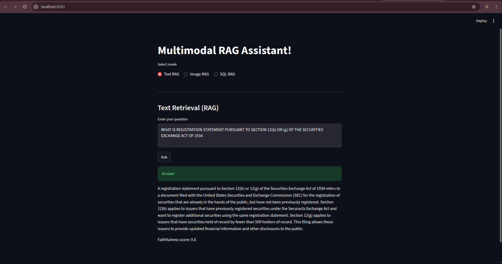
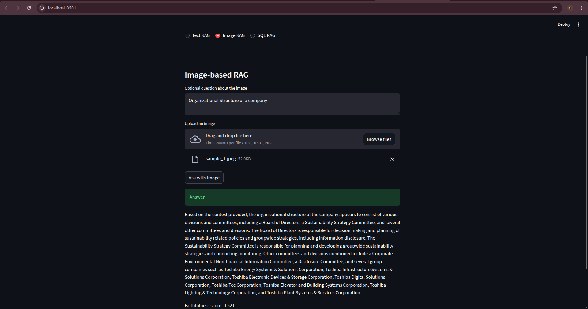
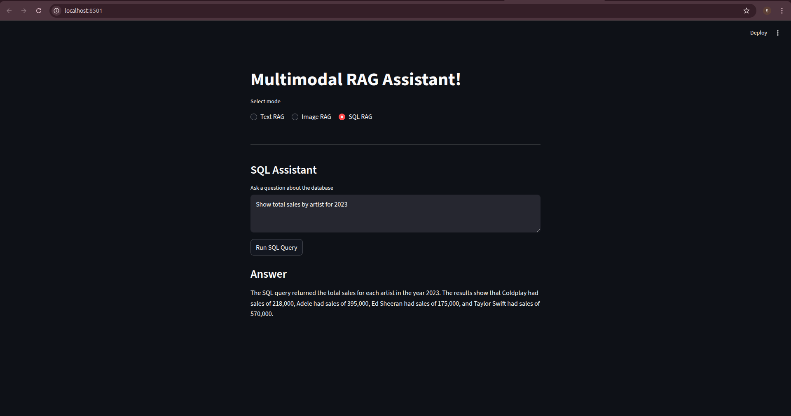

# DEPLOYMENT-NOTES.md

## Project Overview

This project implements a Multimodal RAG Assistant capable of answering:
- Text-based questions using document retrieval (Text RAG)
- Image-based questions using CLIP-powered retrieval (Image RAG)
- Natural-language questions over a structured database (SQL RAG)

The system is built with a FastAPI backend and a Streamlit frontend, designed to be modular and production-oriented.


---

## High-Level Architecture

Streamlit Frontend (HTTP) → FastAPI Backend

Components:
- Text RAG (FAISS + BM25)
- Image RAG (CLIP + FAISS)
- SQL RAG (SQLite + LLM)

Architecture diagram (simplified):
```

┌──────────────┐    HTTP  ┌─────────────┐
│ Streamlit UI │ ───────▶ │  FastAPI    │
└──────────────┘          └────┬────────┘
                               │
    ┌────────────┬─────────────┴─────────┬────────────┐
    │ Text RAG   │ Image RAG             │ SQL RAG    │
    │ (FAISS +   │ (CLIP + FAISS)        │ (SQLite +  │
    │  BM25)     │                       │  LLM)      │
    └────────────┴───────────────────────┴────────────┘
```
---

## Backend (FastAPI)

Entry point:
- File: `src/deployment/app.py`

The backend exposes three production-ready endpoints:

### 1. /ask — Text RAG

Purpose
- Answer questions using retrieved document context.

Flow
1. User sends a question.
2. HybridRetriever performs:
   - Dense vector search (FAISS)
   - Sparse search (BM25)
   - RRF fusion and reranking
3. ContextBuilder formats retrieved chunks.
4. LLM generates the answer.
5. Faithfulness score is computed.

### 2. /ask-image — Image RAG

Purpose
- Handle multimodal queries using images and/or text.

Supported modes
- Text → Image
- Image → Image
- Image → Text (OCR / captions)

Request
- Content type: multipart/form-data
- Accepts:
  - question (optional)
  - image (optional file upload)

Flow
1. Generate CLIP embeddings for input image(s) and ocr text.
2. Perform FAISS search in the image/document index.
3. ImageContextBuilder constructs multimodal context.
4. LLM generates a grounded response.
5. Faithfulness score is computed.

### 3. /ask-sql — SQL RAG

Purpose
- Convert natural language into safe, validated SQL queries and return summaries.

Flow
1. User question → schema-aware prompt
2. LLM generates SQL
3. SQL is validated (read-only enforcement)
4. Query executed on SQLite database
5. Results summarized by LLM

Key safety guarantees
- No INSERT / UPDATE / DELETE allowed
- Schema-restricted queries only
- SQLite-compatible SQL

---

## Frontend (Streamlit)

File: `src/deployment/ui.py`

Features
- Single-page UI
- Mode selection:
  - Text RAG
  - Image RAG
  - SQL RAG
- Image upload support
- Long-running request handling
- Clean, responsive layout using st.columns()

---

## Request Handling & Timeouts

Backend requests can take several minutes due to:
- Embedding generation
- FAISS search
- LLM inference

Increased request timeout to 10 min to handle long LLM calls.

---

## How to Run

Backend
```bash
uvicorn src.deployment.app:app --reload
```

Frontend
```bash
streamlit run src/deployment/ui.py
```

---

## Final Notes

This deployment represents a production-grade foundation for:
- RAG systems
- Multimodal assistants
- SQL-aware agents

---
# Screenshots



